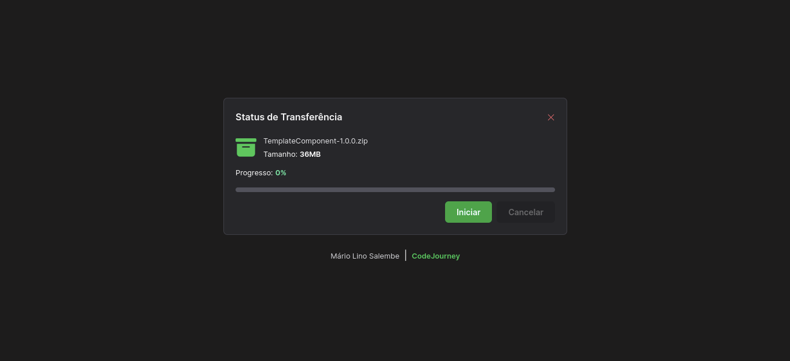
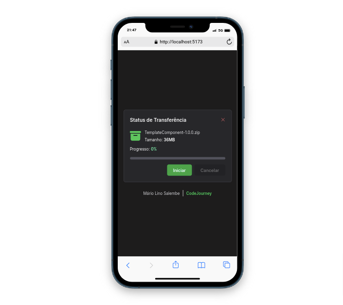

# Component de Progresso

Um component que Simula o Download de um Arquivo que creio poder Ajudar aos Outros Desenvolvedores
utilizarem caso precisem de alguma coisa Pronta

# Tecnologias

--- TAILWIND CSS
--- VUE JS

# Imagens

# LINKS

Github: https://github.com/mariosalembe23
Telegram: https://t.me/mariosalembe
Instagram: [mariosalembe22](https://www.instagram.com/mariosalembe22/)
Repositório: https://github.com/mariosalembe23/Component-Progress.github.io
